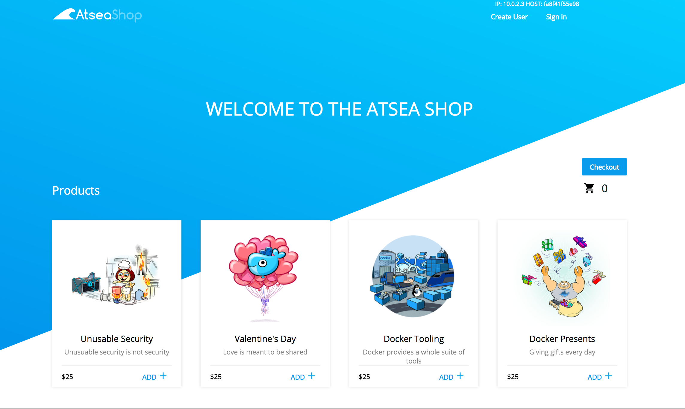

#  AtSea Shop Demonstration Application

The AtSea Shop is a demonstration application comprised of: 

* Java REST application written using Spring-Boot, 
* a database for product inventory, customer data, and orders,
* a React shopping cart,
* a NGINX reverse proxy implementing https,
* a payment gateway to simulate certificate management

# Requirements

This example uses features in Docker 17.05 CE Edge. Install this version to run the example.

# Building and Running the AtSea Shop

## Secrets

This application uses Docker secrets to secure the application components. The reverse proxy requires creating a certificate that is stored as a secret and the payment also requires a password stored as a secret. To create a certificate and add as a secret:

```
mkdir certs

openssl req -newkey rsa:4096 -nodes -sha256 -keyout certs/domain.key -x509 -days 365 -out certs/domain.crt

docker secret create revprox_cert certs/domain.crt

docker secret create revprox_key certs/domain.key

docker secret create postgres_password certs/domain.key
```

To create a secret for staging the payment gateway:

```
echo staging | docker secret create staging_token - 
```

## Run as an application

To run the AtSea shop as an application:
```
docker-compose up --build
```

## Deploy to a swarm
```
#If you need to create a Swarm
docker swarm init
docker stack deploy -c docker-stack.yml atsea
```

## A simplified development environment
This compose file creates a simplified development environment consisting of only the application server and the database.

```
docker-compose --file docker-compose-dev.yml up --build
```


## The AtSea Shop 

The URL for the content is `http://localhost:8080/`

# REST API

Documentation for REST calls: [REST API](./REST.md)


