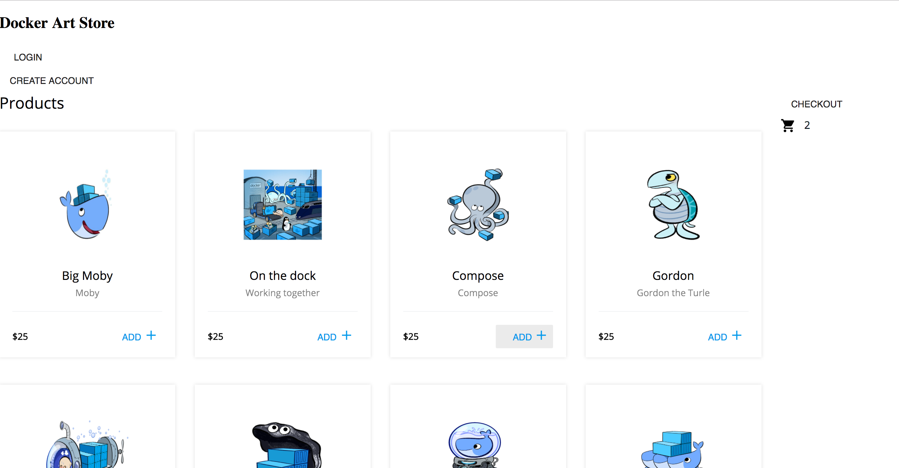
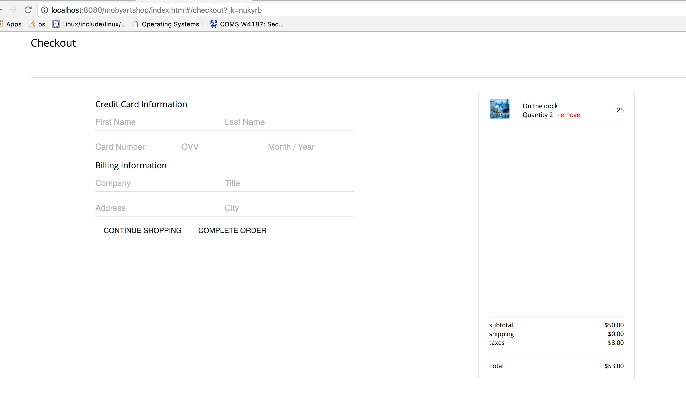

#  AtSea Demo Application

## Current build and run (this will be improved)
```bash
docker run -ti -v $(pwd):/atsea -w /atsea maven:alpine mvn package -DskipTests
docker-compose build
docker-compose up
```

(Unfortunately the above will most likely not work on Linux due to root bind
mount, you will need to get craftier with user remapping if executing there)

## The demo application is a store application with the following features:

* user account creation and sign-in 
* a products page listing all available products
* a detail page for an individual products
* a shopping cart to add products
* an order page that displays the products in the cart and a total

A page for each feature will be needed in the client.

## The application architecture includes:

* microservices REST backend written in Java and spring-boot to handle the store functions
* PostgreSQL database for product inventory, customer data, and order data
* Nginx proxies for serving static data and handling HTTPS request
* store front client written in Angular

## Front end is being written in React and currently looks like this:




Local development:
From the `react-app` directory (within `app`), run `npm install` then `npm run start`.
  Navigate to localhost:3000. Any changes within `react-app` will be updated in real-time.

Update static files:
```bash
  cd react-app
  npm run build
  cd ../
  rm -r static; mv react-app/build static
```
Finally, re-run `docker-compose up`
Navigate to localhost:8080 to see your changes.

* The command `npm run build` builds the react-app for production in the build folder.
  The build is minified and the filenames include the hashes. 
* The command  `mv react-app/build static` moves the build folder to the static folder.
* The multistage build can be seen in `app/Dockerfile.app`
  This includes building and updating the static files.
```bash
    FROM node:latest
    COPY . /usr/src/mobystore
    WORKDIR /usr/src/mobystore/app/react-app
    RUN npm install
    RUN npm run build
```


## The operational architecture features:

### Swarm features supported and highlighted:
* Secrets
* Routing mesh
* Overlay networks
* Dynamic storage (infinit.io)
* Can run as a single stateless container
* Can be deployed as multi-container stateful app through compose v3 (docker stack deploy)
* Can be deployed on Docker 4 Mac for development demo
* Message queue
* Optimize for startup time

### UCP features supported and highlighted:
* L7 loadbalancing (HRM)
* HRM sticky sessions
* HRM HTTPS (SNI)

### Other ideas:
* Jmeter load generation
* NFS store for static content

## Configuration

### Static content
Make a directory for static content called 'static' in the same directory as the appication (atsea-0.0.1-SNAPSHOT.jar)

```
Application
|- AtSea-0.0.1-SNAPSHOT.jar
|- static/
   |- client files
   |- images
   |_ ...

```

the URL for the content is http://localhost:8080/atsea/*


## REST Requests

### Products

#### Get all products
Request:
```
GET /atsea/api/product/

Host: localhost:8080
Auth: 
Content-type: application/json
Accept: application/json

```
Returns:
```
HTTP 200 OK

[    
    {
        "description": "Keeping it safe and secure",
        "image": "/9j/4QAYRXhpZg ...."
        "name": "Trusted Registry",
        "price": 25.0,
        "productId": 32
    },
    {
        "description": "Moby at work",
        "image": "/9j/4QAYRXhpZg ...."
        "name": "Moby",
        "price": 25.0,
        "productId": 11
    }
]
```
Error:
```
HTTP 204 NO CONTENT
```

#### Get Single Product
Request:
```

GET /atsea/api/product/{id}
Host: localhost:8080
Auth: basic username:password
Content-type: application/json
Accept: application/json

```
Returns:
```
{
        "description": "Keeping it safe and secure",
        "image": "/9j/4QAYRXhpZg ...."
        "name": "Trusted Registry",
        "price": 25.0,
        "productId": 32
}
```
Error:
```
HTTP 404 NOT FOUND
```

### Customer Requests

#### Create Customer
Request:
```
POST /api/customer/
Host: localhost:8080
Auth: 
Content-type: application/json
Accept: application/json

{
    "customerId" : 0,
    "name"       : "Sally Vallery",
    "address"    : "address as single string",
    "email"      : "sally@example.com".
    "phone"      : "phone as string"
    "username"   : "sallyv",
    "password"   : "sallypassword",
    "enabled"    : "true",
    "role"       : "USER"
}
```
Returns:

```
customerId

{
    "customerId": 1
}
```
Error:
```
HTTP 409 CONFLICT
{
    "error" : "Unable to create customer with username xxxx"
}
```

#### Get Customer
Request:
```
GET /api/customer/{id}

Host: localhost:8080
Auth: 
Content-type: application/json
Accept: application/json
```
Returns:
```
{
    "customerId" : 54321,
    "name" : "Sally Vallery",
    "address" : "address as single string",
    "email" : "sally@example.com".
    "phone" : "phone as string"
    "username" : "sallyv",
    "password" : "sallypassword"
}
```
Error:
```
HTTP 404 NOT FOUND
{
    "error":"Customer with id xx not found."
}
```

### Get Customer by Name
Request:
```
GET /api/customer/name={name}

Host: localhost:8080
Auth: 
Content-type: application/json
Accept: application/json
```

Returns:
```
{
    "customerId":9,
    "name":"Space Goat",
    "address":"1800 Nebula Rd",
    "email":"spacegoatlabel@gmail.com",
    "phone":"222-333-4444",
    "username":"spacegoat",
    "password":"spacegoatpass",
    "enabled":true,
    "role":"USER"
}
```
Error:
```
HTTP 404 NOT FOUND
{
    "error":"Customer with name xxx not found"
}
```
### Get Customer by Username
Request:
```
GET /api/customer/username={username}

Host: localhost:8080
Auth: 
Content-type: application/json
Accept: application/json
```

Returns:
```
{
    "customerId":9,
    "name":"Space Goat",
    "address":"1800 Nebula Rd",
    "email":"spacegoatlabel@gmail.com",
    "phone":"222-333-4444",
    "username":"spacegoat",
    "password":"spacegoatpass",
    "enabled":true,
    "role":"USER"
}
```
Error:
```
HTTP 404 NOT FOUND
{
    "error":"Customer with username xxx not found"
}
```
### Update Customer
Request:
```
PUT /api/customer/{customerId}
Host: localhost:8080
Auth: 
Content-type: application/json
Accept: application/json

{
    "customerId" : 0,
    "name"       : "Sally Vallery",
    "address"    : "my new address",
    "email"      : "sally@example.com".
    "phone"      : "phone as string"
    "username"   : "sallyv",
    "password"   : "sallynewpassword",
    "enabled"    : "true",
    "role"       : "USER"
}

```

Returns:
```
OK 200
{
    "customerId" : 0,
    "name"       : "Sally Vallery",
    "address"    : "my new address",
    "email"      : "sally@example.com".
    "phone"      : "phone as string"
    "username"   : "sallyv",
    "password"   : "betterpassword",
    "enabled"    : "true",
    "role"       : "USER"
}
```
Error:
```
HTTP 404 NOT FOUND
{
    "error":"Unable to update. Customer with id xxx not found"
}
```

### Delete a Customer
Request:
```
DELETE /api/customer/{customerId}
Host: localhost:8080
Auth: 
Content-type: application/json
Accept: 

```
Returns:
```

OK 204 NO CONTENT
```
Error:
```
{
    "error":"Unable to delete. Customer with id xx not found."
}
```

### Delete all Customers
Request:
```
DELETE /api/customer/
Host: localhost:8080
Auth: 
Content-type: application/json
Accept: 

```
Returns:
```

OK 204 NO CONTENT
```
### Order Requests

#### Create an Order
Request:
```
POST /api/order/
Host: localhost:8080
Auth:
Content-type: application/json
Accept: application/json

{
    "orderId" : 1,
    "orderDate : {current date},
    "customerId" : "54321",
    "productsOrdered" : {
                          "1":1,
                          "2":1,
                          "3":1
                        }
}

```
Returns:
```
HTTP 201 CREATED
{
    "orderId": 1
}
```
Error:
```
HTTP 409 CONFLICT
{
    "error":"Unable to create. An order with id xx already exists"
}
```
#### Get All Orders
Request:
```
GET /api/order/
Host: localhost:8080
Auth: 
Content-type: application/json
Accept: application/json
```
Returns:
```
HTTP 200 OK

[
    {
        "orderId" : 1,
        "orderDate : {current date},
        "customerId" : "54321",
        "productsOrdered" : {"1":1,"2":1,"3":1}
    },
    {
        "orderId" : 2,
        "orderDate : {current date},
        "customerId" : "12345",
        "productsOrdered" : {"2":1,"3":1,"4":1}
    }
]
```
Error:
```
HTTP 404 NO CONTENT
```

#### Get an Order by Id
Request:
```
GET /api/order/{orderId}
Host: localhost:8080
Auth: 
Content-type: application/json
Accept: application/json
```
Returns:
```
HTTP 200 OK

    {
        "orderId" : 1,
        "orderDate : {current date},
        "customerId" : "54321",
        "productsOrdered" : {"1":1,"2":1,"3":1]
    }
```
Error:
```
HTTP 404 NOT FOUND
{
    "error":"Order with id xx not found."
}
```
#### Update an Order
Request:
```
POST: /api/order/{orderId}
Host: localhost:8080
Auth: 
Content-type: application/json
Accept: application/json
{
    "orderId" : "0", 
    "productsOrdered" : {
                          "3":2,
                          "6":3,
                          "11":2
                        },
     "orderDate" : "2017-02-28T19:52:39Z", 
     "customerId" : "8"
}
```
Returns:
```
HTTP 200 OK
{
    "customerId": 8,
    "orderDate": "2017-02-28T19:52:39Z",
    "orderId": 8,
    "productsOrdered": {
                        "11": 1,
                        "3": 1,
                        "6": 1
                        }
}
```
Error:
```
HTTP 404 NOT FOUND
{
    "error":"Unable to update. Order with id xx not found."
}
```
#### Delete an Order
Request:
```
DELETE: /api/order/{orderId}
Host: localhost:8080
Auth:
Content-type: application/json
Accept: application/json
```
Returns:
```
HTTP 204 OK
```
Error:
```
HTTP 404 NOT FOUND
{
    "error":""Unable to delete order. Order with id xx not found."
}
```
### System Utilities

#### Database Healthcheck
Request:
 ```
GET: /utility/healthcheck/
Host: localhost:8080
Auth: 
Content-type: application/json
Accept: application/json
```
Returns:
```
HTTP 200 OK
{
    "status":"2017-03-27 03:01"
}
 ```
Error:
```
HTTP 500 INTERNAL SERVER ERROR
{
    "error":"Database not responding."
}
```
 #### Get Container Id
Request:
```
GET: /utility/containerid/
Host: localhost:8080
Auth: 
Content-type: application/json
Accept: application/json
```
Returns:
```
HTTP 200 OK
{
    "host": "spara-mbp",
    "ip": "192.168.0.6"
}
```
Error:
```
HTTP 404 NOT FOUND
{
    "error":"Container id not found"
}
